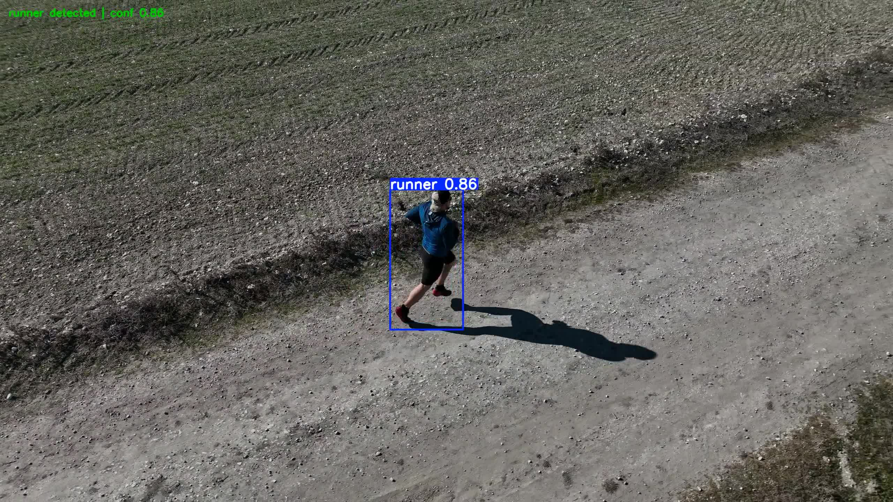

# Runner Tracking Neural Perception

This repository contains the data and model-development pipeline for the neural
perception component of an autonomous runner-tracking drone. It turns licensed
runner videos or ROS 2 camera recordings into leakage-safe YOLO datasets,
audits and curates the annotations, trains a compact detector, and prepares the
result for edge inference alongside ROS 2, Nav2, and OpenVINO.

## Current dataset milestone

- 412 curated real-world images across seven independent recording sessions
- 436 runner bounding boxes after false-positive and duplicate cleanup
- 360 training images and 52 validation images
- Session-exclusive split to prevent adjacent video frames leaking between
  training and validation
- Zero missing labels, duplicate-image groups, validator errors, or warnings
- Corrected aerial desert sequence where terrain vegetation had been labelled
  instead of the runner

The source images and videos are intentionally not committed. They total nearly
1 GB and remain governed by the original Pexels license. The repository keeps
the source manifests, extraction code, exact split manifest, curated YOLO label
files, and audit trail needed to reproduce the dataset.

See [the dataset card](DATASET_CARD.md) for provenance and limitations.

## Trained-model validation milestone

The first 75-epoch YOLO11n checkpoint was tested on the first five seconds of
the session-held-out `rural_path` recording (300 frames at 59.94 FPS). The
runner was detected in every processed frame with no temporal detection gaps.
All 34 curated validation frames in that interval matched their ground-truth
box at IoU >= 0.50.

| Measurement | Result |
| --- | ---: |
| Frame detection rate | 100% (300/300) |
| Labeled-frame match rate at IoU 0.50 | 100% (34/34) |
| Mean best IoU on labeled frames | 0.858 |
| Mean detection confidence | 0.769 |
| Longest detection gap | 0 frames |



The [annotated H.264 review video](docs/model_validation/heldout_rural_path_20260831/rural_path_heldout_annotated.mp4),
[machine-readable metrics](docs/model_validation/heldout_rural_path_20260831/metrics.json),
and [test methodology](docs/model_validation/heldout_rural_path_20260831/README.md)
are committed as portfolio evidence. This is a focused session-level test, not
a claim of production safety or broad-domain generalization.

## Repository layout

```text
ml/
  train.py                         reproducible Ultralytics training entrypoint
  config/train_robust.yaml         outdoor/drone augmentation profile
  scripts/                         acquisition, extraction, curation and audit
  tests/                           unit and pipeline tests
  manifests/                       reviewed public-video source manifests
data/public_runner_v1/
  labels/{train,val}/              curated YOLO annotations
  runner_v1.yaml                   portable Ultralytics dataset configuration
  splits_v1.json                   session-exclusive split and sample manifest
  dataset_report.json              final structural validation
docs/label_audit/                  cleanup log, prior labels and review evidence
docs/model_validation/             held-out model tests and review media
colab/train_runner_yolo11.py       self-contained 75-epoch Colab trainer
```

## Recreate the public runner dataset

Install dependencies in an isolated ML environment:

```bash
python -m venv .venv
source .venv/bin/activate
python -m pip install -r requirements.txt
python -m pip install -r ml/requirements-public-data.txt
```

Download the reviewed public clips and regenerate candidate frames:

```bash
python ml/scripts/download_public_runner_clips.py --help
python ml/scripts/source_public_runner_data.py \
  --provider local \
  --input data/public_runner_clips \
  --output data/public_runner_v1
```

Run the structural validator and tests before training:

```bash
python ml/scripts/validate_yolo_dataset.py \
  --dataset-root data/public_runner_v1 \
  --class-count 1
python -m pytest ml/tests -q
```

The detailed ingestion, session-splitting, annotation, and simulation-data
workflows are documented in [ml/README.md](ml/README.md).

## Train

For the local robust configuration:

```bash
python ml/train.py \
  --config ml/config/train_robust.yaml \
  --data data/public_runner_v1/runner_v1.yaml \
  --model yolo11n.pt \
  --epochs 75 \
  --allow-unreviewed
```

`--allow-unreviewed` acknowledges that the current public-video boxes have
passed automated and contact-sheet audits but have not yet received an
independent frame-by-frame human-review attestation.

For a free Google Colab GPU, upload a ZIP containing the complete
`public_runner_v1` dataset and run
[`colab/train_runner_yolo11.py`](colab/train_runner_yolo11.py) in one notebook
cell. It rewrites local dataset paths, verifies all image/label pairs, trains
for 75 epochs, validates `best.pt`, and packages the run for download.
The script prints seven numbered stages, skips dependency installation when the
packages are already present, and clearly distinguishes the upload wait from
the automatic epoch loop.

Alternatively, open the
[one-click Colab notebook](colab/runner_yolo11_training.ipynb), select a GPU,
run its single code cell, and choose the prepared dataset ZIP when prompted.

Evaluate a trained checkpoint against a video and generate an annotated video
plus JSON metrics:

```bash
python ml/scripts/evaluate_runner_video.py \
  --weights /path/to/best.pt \
  --video /path/to/held_out_video.mp4 \
  --output-video artifacts/held_out_annotated.mp4 \
  --output-json artifacts/held_out_metrics.json \
  --conf 0.25 \
  --imgsz 640
```

## Scope

This repository certifies perception dataset and detector development. Flight
control, Nav2 planning, MAVROS integration, and the zero-physics navigation
sandbox remain in the separate autonomous-drone repository.
